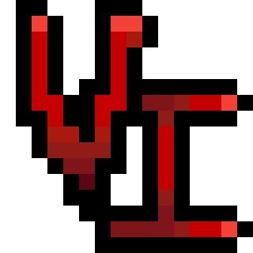
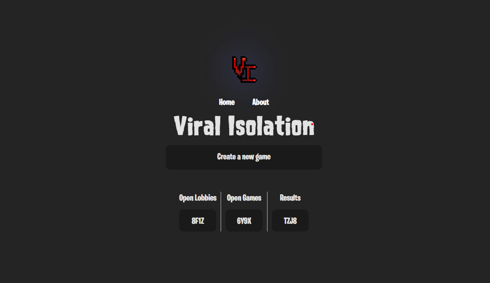
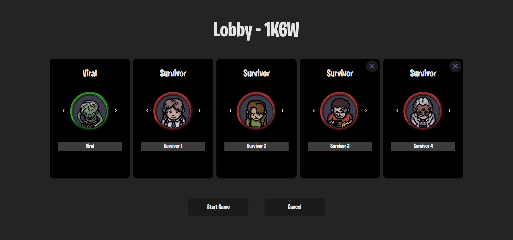
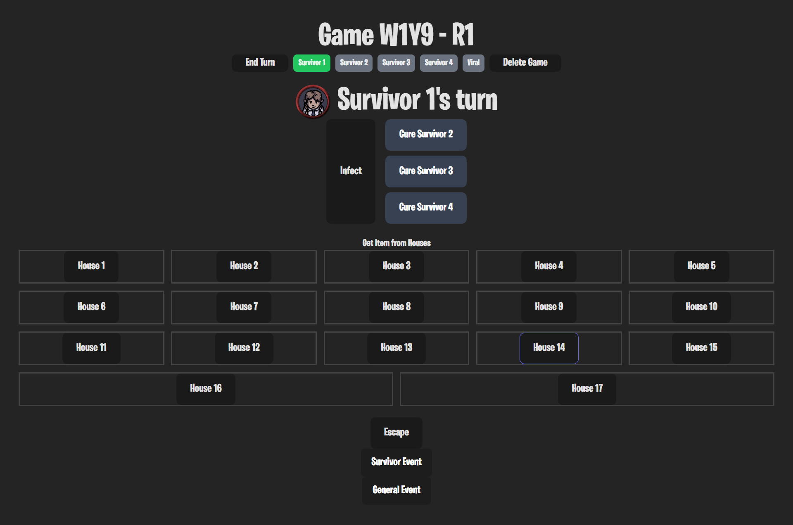
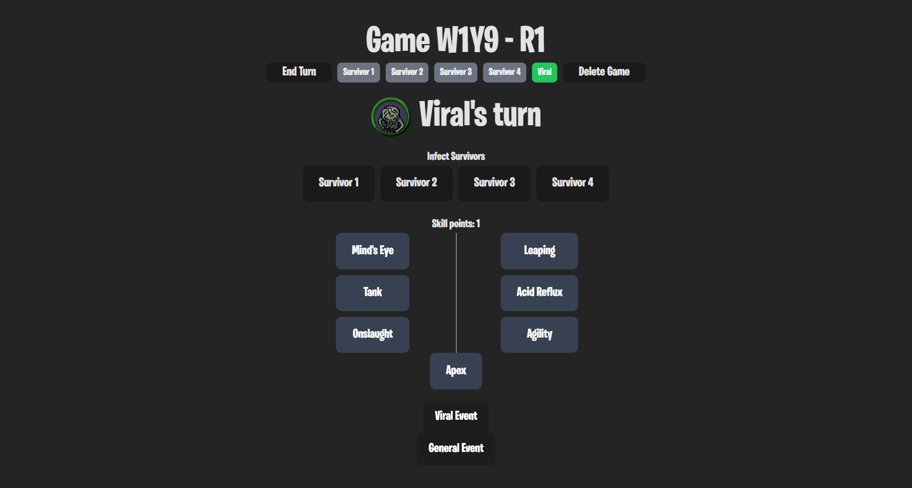

#  [Viral Isolation](http://viral-isolation.pages.dev)

Viral Isolation web app is a digital companion of its physical board game for Game Design (GAMEDES) class. It was developed using MongoDB, Express, React, Node.js, TypeScript, Tailwind, and Socket.io.

## Run locally
To run the web app locally, follow these steps:

0. Make sure MongoDB is installed.
1. Clone the repository.
2. In `server` folder, duplicate `.env.default` and omit `.default` in its file name.
3. Open two cmd or terminal within the folder and run the following commands:
   - (Client) `npm i && npm run dev`
   - (Server) `cd server && npm i && npm start`
4. Open `http://127.0.0.1:5173/` (or the link provided by the Client console) in browser.

## Description

Viral Isolation is an asymmetrical board game where the Survivors have to find a key in a house to escape while trying their best to avoid a fast mutating Viral player.

This game has two sides to it:
1. Play as a Survivor alongside your friends as all of you try your best to avoid a common enemy, the Viral, and reach the end goal of escaping the map or die trying.
2. Play as the Viral and hunt down and infect as many survivors as possible. Create your own strategy as you find the optimal use of your skills and movement abilities.

There can be only 1 Viral player and 2 up to 4 Survivor players. The Viral player will proceed to hunt down all of the Survivors and mutate, gaining various new abilities as the game progresses. Meanwhile the survivors try their best to find the keycard and escape while helping or even betraying their friends.

[Click here to learn more about the game.](https://viral-isolation.pages.dev/about)

### About the web app (digital companion)

The web application manages the following:
-  randomization of:
   - player turn order
   - game events
   - keycard location
   - number of items and item capacity per house
- infect/cure Survivors mechanic
- skill points and skill tree of the Viral
- the houses Survivors entered
- the card to draw (either the keycard or an item) when entering a house
- keycard location announcement at Rounds 4/7/10 (if there are 2/3/4 Survivors)

It features long press buttons to avoid accidental button press, sfx for events and announcement, and a scoreboard/result system.

It uses sockets (Socket.io) to connect to the server one client/user at a time to avoid multiple requests on the same game.

## Screenshots
*Physical board game*

*Web app*

## Credits

Viral Isolation web app was developed by the following team members:

- [ubergonmx](https://github.com/ubergonmx) - Producer and Tech Lead
- [MarcGabrielBaura](https://github.com/MarcGabrielBaura) - Frontend Developer/QA
- [Jasper-Chua](https://github.com/Jasper-Chua) - Frontend Developer/QA
- [JohnMarcSevillana](https://github.com/JohnMarcSevillana) - 
Frontend Developer/QA